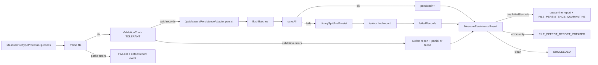

# Measure Flow Onboarding

## Objetivo
Guia rapida para entender el flujo de medidas en ingestion:

`parse -> validate -> persist (batch + binary split) -> resultado -> cuarentena/outbox`

## Flujo de punta a punta

## Responsabilidades por clase

- `MeasureFileTypeProcessor`:
  - orquesta parse, validacion y persistencia
  - decide `SUCCEEDED` / `FAILED` / parcial
  - publica eventos diferidos de defectos/cuarentena

- `JpaMeasurePersistenceAdapter`:
  - resuelve cliente por CUPS (cache por lote)
  - mapea `MeasureRecord` a entidad JPA (P1/P2/F5/P5)
  - persiste en lotes de `DEFAULT_BATCH_SIZE=1000`
  - si falla `saveAll`, aplica binary split para aislar el registro malo
  - retorna `failedRecords` para cuarentena

- `MeasurePersistenceContracts.MeasurePersistenceResult`:
  - `persistedCount`, `errorCount`, `skippedCount`
  - `errors`
  - `failedRecords` (clave para cuarentena)

## Que mirar cuando hay incidentes

- Parse falla: revisar parser y reporte `.sge_defect.jsonl`
- Validacion falla: revisar `MeasureRecordValidationChain`
- Persistencia parcial/fallo: revisar logs de `binarySplitAndPersist`
- Cuarentena: verificar evento `FILE_PERSISTENCE_QUARANTINE`

## Reglas importantes

- Validacion es tolerante: se intenta persistir lo valido
- Binary split busca salvar el maximo de registros
- Un registro malo no debe tumbar todo el archivo
- `failedRecords` debe llegar al processor para activar cuarentena

## Archivos clave

- `c4e-ingestion-service/src/main/java/com/com4energy/processor/service/processing/MeasureFileTypeProcessor.java`
- `c4e-ingestion-service/src/main/java/com/com4energy/processor/service/measure/persistence/JpaMeasurePersistenceAdapter.java`
- `c4e-ingestion-service/src/main/java/com/com4energy/processor/service/measure/persistence/MeasurePersistenceContracts.java`
- `c4e-ingestion-service/docs/BINARY_SPLIT_QUARANTINE.md`

